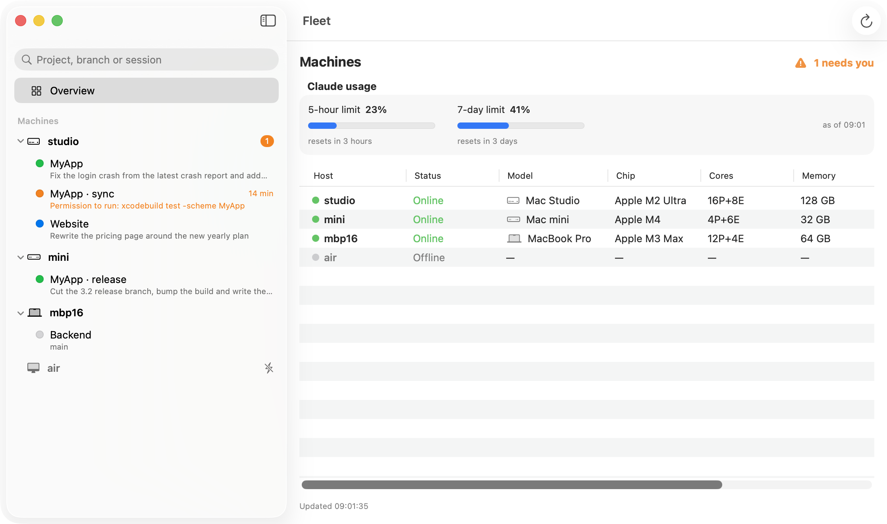
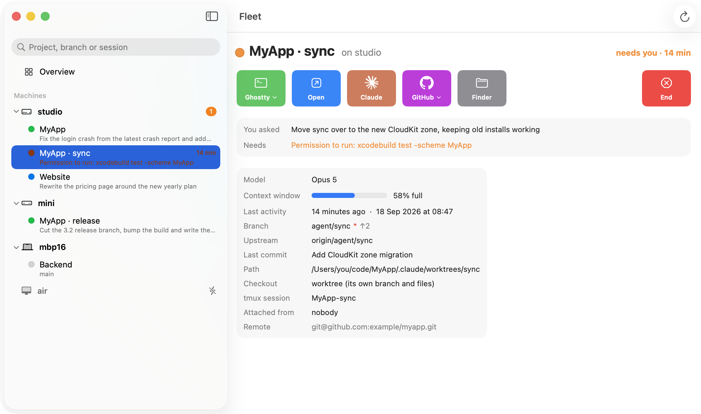

# fleet

A command-line tool to start, watch and reach Claude Code agents across
your Macs: one bash script, `fleet`, that runs the same on every machine,
including over ssh from a phone. An optional Mac app (and an iPhone app)
wraps the script; the script needs neither.



```
fleet ls [--all] [--json] [host...]   sessions on every host; --all: every clone; --json: records
fleet attach [host session]           attach to a session here (tmux prefix+d detaches)
fleet open   [host session]           pull its branch onto this Mac and open it (see FLEET_OPEN)
fleet shell  [host] [dir]             a login shell on that Mac
fleet kill [-y] <host> <session>      end a session: the agent is asked to /exit, then tmux is closed
fleet new [host] [project] [name]     start a session there; a name adds a session, or a worktree
                                      (--model <m>: which Claude model; default: Claude Code's choice)
fleet projects [host] [--json]        repos under FLEET_ROOT there
fleet models [host] [--json]          the models Claude Code there can start with, and its default
fleet convert <project>               enable worktrees for a clone (on that Mac)
fleet reap                            remove worktrees with nothing beyond the default branch
fleet hosts [add [alias]|rm <alias>]  the host list, pushed to every Mac
fleet hosts info [host...] [--json]   chip, cores, memory, load per host
fleet keys [add "<pubkey>"|rm <name>]  authorize the phone app's ssh key on every Mac, or revoke it
fleet doctor [host...]                check install and config
fleet install|update [host...|all]    clone or pull fleet there, link it, seed config and hooks
fleet status [--all] [--json]         this host only
```

`fleet ls`:

```
usage: 5-hour 23%  ·  7-day 41%

myapp
  main             studio   ● running       2m ago   · fix the login crash
  sync             mbp16    ▲ needs you    14m ago  * · permission to run xcodebuild
  hotfix           studio   ✓ done         40m ago  ↑3 · all tests pass
```

`● running` the agent is working, `▲ needs you` it stopped for permission
or input, `✓ done` it finished its turn, `· idle` the session ended,
`◦ alive` the tmux session exists but no hook has reported yet. `*` dirty,
`↑n`/`↓n` ahead/behind upstream, `no upstream` never pushed. The last column
is what the agent is asking for, else what it was told to do. The usage
line is your account's rate limits, from the newest status line snapshot.

Sessions are `claude -n <machine>-<project>-<name> --permission-mode auto
--remote-control` in a tmux session named `<project>-<name>`, so they also
appear in the Claude apps, where the machine tells two Macs' sessions apart. `FLEET_CLAUDE_ARGS` in the config changes
the flags. `FLEET_TERM=ghostty|terminal|iterm` makes attach and shell open
a window in that app instead of the current terminal, raising an existing
window on the session when there is one.

Read [SECURITY.md](SECURITY.md) before adding machines: fleet runs commands
on every host over ssh and updates its own code from this repo.

## Install

```bash
git clone https://github.com/CrunchyBagel/fleet ~/Developer/fleet && ~/Developer/fleet/fleet install
```

That links `~/bin/fleet`, seeds `~/.config/fleet/config`, installs jq, fzf
and tmux if missing, and adds the Claude Code hooks and status line (below).

If your projects are on GitHub, sign the GitHub CLI in on every Mac with a
file token, so agents in ssh-started sessions can push (ssh logins cannot
unlock the Keychain): `brew install gh && gh auth login --insecure-storage`.
Install uses it when it is there and plain git otherwise.
Then `fleet hosts add` (every Mac on the tailnet, or one alias) and `fleet
doctor`. Other Macs are set up from this one:

```bash
fleet install mini      # or: fleet install all
fleet update all        # after you push a change
```

ssh runs commands without your shell's rc files, so fleet prepends
`FLEET_PATH` (default `~/bin`, `~/.local/bin`, Homebrew) itself everywhere.

## Config

Two files in `~/.config/fleet/` on every Mac, neither in git.

`hosts`: one ssh destination per line. With Tailscale and MagicDNS that is
each Mac's tailnet name and no `~/.ssh/config` is needed. `fleet hosts
add|rm` edit it here and push it to every reachable host; `fleet doctor`
names a host whose copy differs.

`config`, seeded by install:

```bash
FLEET_SELF="laptop"          # this Mac's tailnet name, detected at install
FLEET_ROOT="$HOME/Developer" # where your clones live: install guesses the folder under
                             # $HOME with the most clones; doctor names it when this is wrong
# FLEET_OPEN=auto            # what `fleet open` opens the checkout in (below)
# FLEET_PATH, FLEET_TERM, FLEET_CLAUDE_ARGS, FLEET_SSH_TIMEOUT...: see the file
```

Optional, so repeated ssh calls reuse one connection:

```
Host *.ts.net
  ControlMaster auto
  ControlPath ~/.ssh/cm-%r@%h:%p
  ControlPersist 10m
```

## Repo layout

A project is any git repository directly under `FLEET_ROOT`. Nothing is
moved. By default a session runs in the clone itself, on whatever branch it
is on; a name gives you a second session in the same working tree:

```bash
fleet new                    # pick a project on this Mac
fleet new mini MyApp         # session "main" in that clone on mini
fleet new mini MyApp review  # a second, named session, same clone
```

To run several agents on one project without sharing a working tree,
convert it on the Mac that has it: `fleet convert MyApp`. From then on a
name makes a worktree at `MyApp/.claude/worktrees/<name>` on branch
`agent/<name>`, excluded from the clone's `git status`; no name still means
the clone. `fleet reap` removes worktrees whose branch has nothing beyond
the default branch and skips dirty ones.

## Claude Code hooks and status line

`fleet install` merges five hooks into `~/.claude/settings.json` (keeping a
`.fleet-backup` copy the first time) and points the status line at `fleet
statusline`, chained in front of whatever command was there. The hooks
report state (running, needs you, done, idle), what the agent was asked to
do, what it is asking for, and what it said when it finished. The status
line reports the model, context use, cost and your account's usage limits.
Nothing is scraped from the terminal. An agent started outside tmux does
not report and shows as `◦ alive`.

## Keeping Claude setups aligned

Each Mac collects its own plugins, MCP servers, settings and permission
rules. `fleet claude` shows them side by side (`--diff` for just the
differences), and you fix one row at a time:

    fleet claude --diff
    fleet claude copy plugin superpowers@claude-plugins-official --from this --to all
    fleet claude copy mcp xcode --from mini --to this
    fleet claude copy perm "allow:Bash(git log:*)" --from this --to studio
    fleet claude rm plugin swift-lsp@claude-plugins-official laptop

Nothing changes unless you run `copy` or `rm`. An http MCP server that signs
in with OAuth has to be authenticated once on the new Mac (`/mcp`).

## Opening a checkout

`fleet open` fetches the session's branch into the local clone (or a local
worktree), fast-forwards, and opens it. The local clone is the directory
of the same name under `FLEET_ROOT`, or failing that the one clone there
with the same origin, so a repo may sit under different directory names on
different Macs. What it opens it in is `FLEET_OPEN`
in the config: `auto` (the default) means Xcode when the checkout has a
workspace or project and Xcode is installed, else the folder in Finder;
`xcode` or `finder` force one; anything else is a command or app given the
directory, e.g. `code`, `cursor`, `zed`. Web and other non-Xcode projects
set it to their editor.

### If you use Xcode

Xcode gets the workspace or project, after a background build to warm the
package and module caches. Two settings keep branch switches from costing a
full rebuild:

```bash
git config --global core.excludesfile ~/.gitignore_global
echo ".build/" >> ~/.gitignore_global
```

and Xcode > Settings > Locations > Derived Data: Custom, Relative to
Workspace, path `.build`. `fleet doctor` checks both when Xcode is installed.

## Verify

```bash
fleet doctor            # every host; non-zero exit if anything failed
fleet doctor mini
```

Doctor checks config, PATH, the hooks and status line, and for remote hosts
that ssh works in BatchMode, that their `FLEET_SELF`, script and host list
match yours, and that `fleet status` over ssh returns JSON. `fleet update`
lists incoming commits, fast-forwards only, and with
`~/.config/fleet/allowed_signers` present requires a signed tip.

## Design

- State comes only from Claude Code's hooks; fleet never guesses from pane
  output.
- No daemon: everything is polled over ssh when you ask.
- Not a git client: no diffs, history or staging.
- Nothing is built remotely. `open` pulls the branch here; the debugger is
  local because the build is.
- It never fast-forwards a diverged worktree or switches a clone with
  modified tracked files; it says so and leaves it alone.

## Tests

`test/run.sh` builds throwaway repos in a temp dir and runs every command
under stock `/bin/bash` 3.2 with stand-ins for ssh, tmux, claude, fzf, open
and xed. No network. `-v` prints each assertion.

## Apps

`app/Fleet.xcodeproj` holds two apps over the CLI, generated from
`app/project.yml` with XcodeGen and committed.

**Mac.** A window over the CLI: machines in the sidebar, each with
its sessions and what they are doing; a session's buttons attach, open a
shell, pull into Xcode, open Claude or GitHub, screen share, or end it; a
machine's screen runs doctor, updates fleet, and starts sessions. It
notifies you when an agent needs you, keeps a count in the menu bar and
Dock, and shows your usage limits. Settings cover the terminal app, polling,
which buttons to show, and the host list.



Run the `Fleet` scheme. It runs `~/bin/fleet` (or `$FLEET_BIN`) and is not
sandboxed, since fleet runs ssh, tmux and git. The screenshots above come
from `docs/demo-fleet`, a stand-in fleet with made-up hosts and sessions:
`FLEET_BIN=$PWD/docs/demo-fleet` when launching the app (`FLEET_SELECT=studio/MyApp-sync`
picks what it shows).

**iPhone.** The `FleetMobile` scheme, for a phone on your tailnet (Tailscale
app). It runs fleet on each Mac over ssh with a key it makes itself: on
first launch it shows the key and the one command that authorizes it on
every Mac, `fleet keys add "…"`, then asks one Mac for the host list. From
there: what each agent is doing and what needs you, your usage limits,
start a session on any Mac, open it in the Claude app, end it. Host keys
are pinned on first connection. Lose the phone: `fleet keys rm fleet-<its
name>`. Build it in Xcode with your own team; there is no App Store build.

## License

MIT, see [LICENSE](LICENSE).
